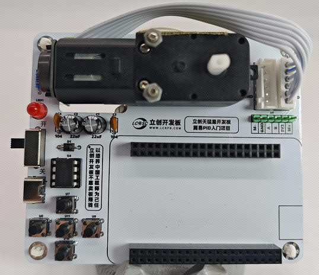

# 简易PID入门套件

<table>
<thead>
  <tr>
      <th></th>
      <th></th>
  </tr>
</thead>
</table>
 

## 项目介绍

基于 立创·天猛星 MSPM0G3507 开发板制作的简易 PID 入门套件，对带编码器的电机，使用 PID 控制算法，实现 `定速功能` 和 `定距功能`，再通过屏幕显示出 PID 参数以及当前值与目标值的曲线变化。

硬件使用立创·天猛星 MSPM0G3507 开发板作为主控，BDR6126D 作为电机驱动，屏幕使用1.9寸中景园SPI屏幕。电机接口适配市场上大多数编码器电机接口。

  <strong style="color: #003a8c; display: block; margin-bottom: 10px;">定速与定距功能说明</strong>
  
  

    - <strong>定速：</strong> 获取当前电机速度，然后根据设定的目标速度，让电机通过 PID 控制算法，使电机当前实时速度以最快的速度接近设定的目标速度。  
    - <strong>定距：</strong> 根据电机旋转一圈的编码器脉冲数，确定电机旋转一圈为多少个 x 脉冲（x脉冲/圈），通过当前脉冲数和目标脉冲数，通过 PID 控制算法，使电机当前实时脉冲以最快的速度接近设定的目标脉冲，达到定距移动的效果。（简单来说就是让电机固定走多少步，走多了就退回，走少了就再走几步）
  

该项目在硬件上，除开发板外，仅使用一个编码器电机 + 电机驱动 + 屏幕 + 按键 + 电源。元器件全插件，方便焊接入门与练习。

<table>
<thead>
  <tr>
      <th></th>
      <th></th>
  </tr>
  <tr>
      <th>
项目焊接说明表
</th>
      <th>
PCB焊接组装完成展示
</th>
  </tr>  
</thead>
</table>

项目在软件方面，使用裸机的方式编写驱动和逻辑，通过 轮询 + 中断 + 状态机 的架构完成项目。PID 部分不会大篇幅介绍背景、由来、模型等学术说明，将直接告诉你如何使用PID。最终可像 1 + 1 = 2 一样，直接将参数无脑带入公式，应用PID。

  <strong style="color:rgb(57, 130, 202);">PID的无脑应用公式</strong>
  

    PID_OUT = （Kp × 误差）+ （Ki × 累计误差）+（Kd × 误差间的差值）
  

<table>
<thead>
  <tr>
      <th></th>
      <th></th>
  </tr>
  <tr>
      <th>
定速闭环控制框图
</th>
      <th>
定距闭环控制框图
</th>
  </tr>  
</thead>
</table>

## 功能需求

- 屏幕显示二级菜单，通过按键选择；
- 屏幕显示PID曲线变化；
- 按键长短按控制和调参；
- 实现电机PID的实时定速调整；
- 实现电机PID的实时定距调整；

## 教程目录

项目提供文档和视频教程，双管齐下，助力掌握硬件 + TI-MSPM0 与 PID。

### 文档教程

教程文档在线阅读地址：👉[立创开发板技术文档中心 | 简易PID入门项目](https://wiki.lckfb.com/zh-hans/tmx-mspm0g3507/training/easy-pid-beginner-kit/)

| 序号 | 章节名称        | 进度 | 学习目标                                                                                                                    |
| ---- | --------------- | ---- | --------------------------------------------------------------------------------------------------------------------------- |
| 1    | 电路原理分析    | ✅   | 了解项目的硬件原理图，明白每一个器件的作用                                                                                  |
| 2    | 原理图与PCB设计 | ✅   | 原理图设计包含了元器件选型、搜索以及原理图整理的内容；  PCB设计部分包含边框设计、元器件分类布局、PCB走线与设计检查等内容 |
| 3    | 免费PCB打样     | ✅   | 如何在嘉立创平台进行 **`免费的`** PCB 的打样，并拿到PCB实物                                                                 |
| 4    | 购买器件        | ✅   | 说明项目的器件购买地址和注意事项                                                                                            |
| 5    | PCB焊接练习     | ✅   | 掌握常用焊接工具的使用、插件元器件的焊接与拆卸方法                                                                          |
| 6    | 开发环境搭建    | ✅   | 了解如何基于 Keil 环境下，对 TI 的 MSPM0G3507 进行`开发、调试和下载  `                                                      |
| 7    | 调试模块驱动    | ✅   | 学习如何搭建基于 Keil 的代码编辑调试环境，包括`文件管理、串口调试、LED 调试`等                                              |
| 8    | 彩屏驱动        | ✅   | 学习如何使用MSPM0G3507的keil环境 **`驱动一块1.9寸的SPI接口彩屏`**                                                           |
| 9    | 按键驱动        | ✅   | 明白如何配置GPIO外设为输入模式，能够 使用常用的 **`开源按键库`** 并移植到自己的工程                                         |
| 0    | 电机驱动        | ✅   | 学习通过电机驱动芯片 `BDR6126D` 来驱动电机，并且联合按键 **`实现长按电机转再长按电机停功能`**                               |
| 11   | 编码器驱动      | ✅   | 明白编码器的测速原理，通过电机上的编码器， **`检测电机的速度和旋转方向`**                                                   |
| 12   | UI与界面管理    | ✅   | 熟悉了解本项目的 **`UI绘制方法和思路`**，并且移植到自己的工程当中                                                           |
| 13   | 事件与状态机    | ✅   | 了解常用的软件架构，并 **`将多个架构组合使用到项目中`**                                                                     |
| 14   | PID定速功能     | ✅   | 了解 **`PID的基本公式`**，通过实际值与目标值的误差，**`实现让实时速度以最快的时间接近目标速度`**                            |
| 15   | PID定距功能     | ✅   | 了解 PID 定距功能的实现方式，通过实际值与目标值的误差，**`实现让实时角度以最快的时间接近目标角度`**                         |
| 16   | 完整功能案例    | ✅   |                                                                                                                             |

### 视频教程

视频教程观看地址：👉[电赛TI-基于MSPM0的简易PID项目视频教程合集](https://www.bilibili.com/video/BV1DTVbz7EPu)

更新进度：

| 序号 | 章节名称 | 观看地址 |
| -- | -- | -- |
| 1 | 电路原理 | [电路原理](https://www.bilibili.com/video/BV1DTVbz7EPu) |
| 2 | 原理图绘制 | [原理图绘制](https://www.bilibili.com/video/BV1H2V8z6E8U) |
| 3 | PCB布局 | [PCB布局](https://www.bilibili.com/video/BV1mb53zAEhE) |
| 4 | PCB连线 | [PCB连线](https://www.bilibili.com/video/BV1Qs5VzCEjZ) |
| 5 | 免费打样与器件购买 | [免费打样与器件购买](https://www.bilibili.com/video/BV13s5VzyEEh) |
| 6 | keil的ti环境搭建 | [keil的ti环境搭建](https://www.bilibili.com/video/BV1dBEjzTEPs) |
| 7 | ti工程创建 | [ti工程创建](https://www.bilibili.com/video/BV1vBEjzTExy) |
| 8 | 屏幕驱动 | [屏幕驱动](https://www.bilibili.com/video/BV1bfEFzmEd9) |
| 9 | 按键驱动 | [按键驱动](https://www.bilibili.com/video/BV1wBEszuEQr) |
| 10 | 电机驱动 | [电机驱动](https://www.bilibili.com/video/BV1GJEfzJEHz) |
| ... | ... | ... |
| -- | 串口烧录 | [串口烧录](https://www.bilibili.com/video/BV1GJEfzJEnE) |
| ... | ... | ... |

## 项目展示

<table>
<thead>
  <tr>
      <th></th>
      <th></th> 
      <th></th> 
  </tr>
  <tr>
      <th>
定速功能
</th>
      <th>
定距功能
</th>
      <th>
定速模式PID调参效果 
</th>
  </tr> 
</thead>
</table>
